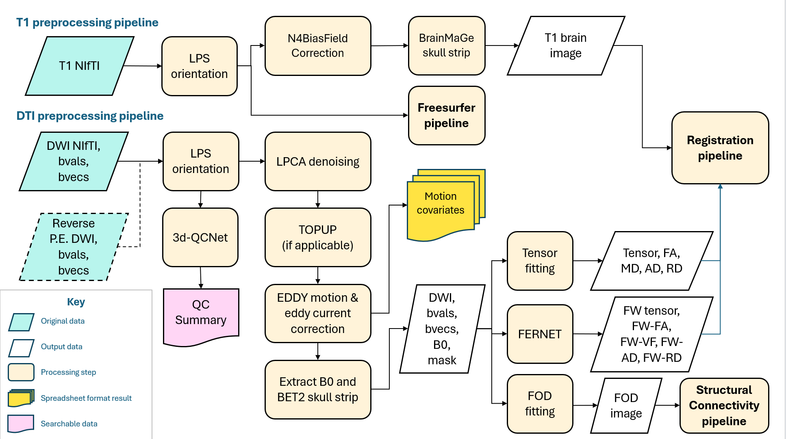
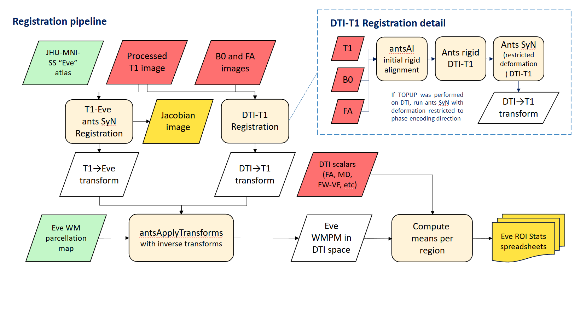

Welcome to the DiCIPHR-Pipeline Documentation
=============================================

This documentation provides an overview of the DiCIPHR-Pipeline and detailed instructions on how to run and use the pipeline effectively. Below are some key references and methodologies used in the pipeline.

Index
==================

* :doc:`RunningDTI`
* :doc:`UsageNotes`
* :ref:`search`
