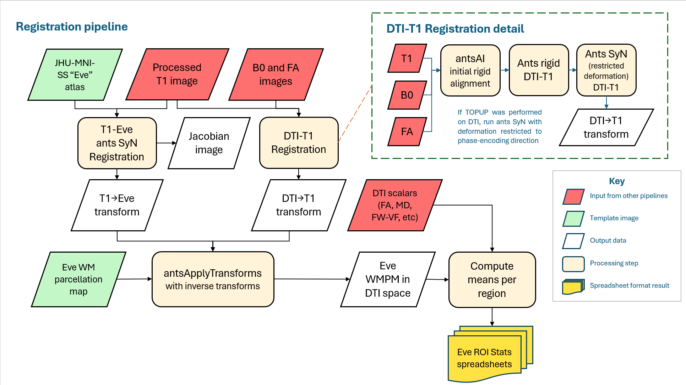

Welcome to the DiCIPHR-Pipeline Documentation
=============================================

This documentation provides an overview of the DiCIPHR-Pipeline and detailed instructions on how to run and use the pipeline effectively. Below are some key references and methodologies used in the pipeline.

.. image:: images/DTI_image1.png
   :alt: T1 and DTI Preprocessing pipeline
   :width: 800px
   :height: 400px
   :scale: 115 %
   :align: center

Index
==================

* :doc:`RunningDTI`
* :doc:`UsageNotes`
* :ref:`search`
